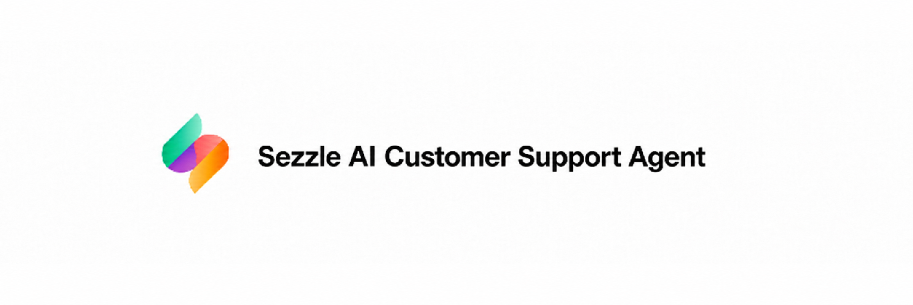
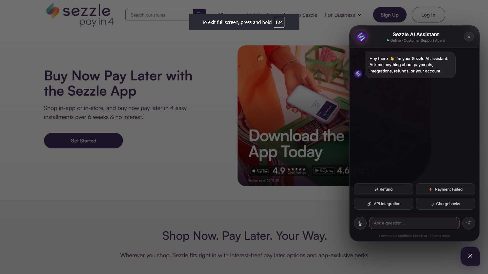
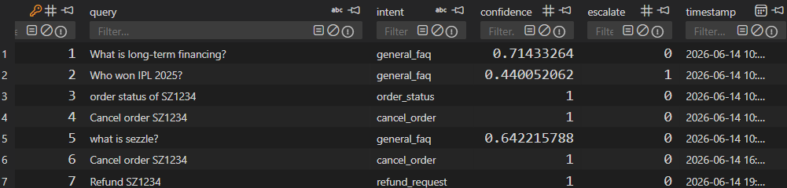
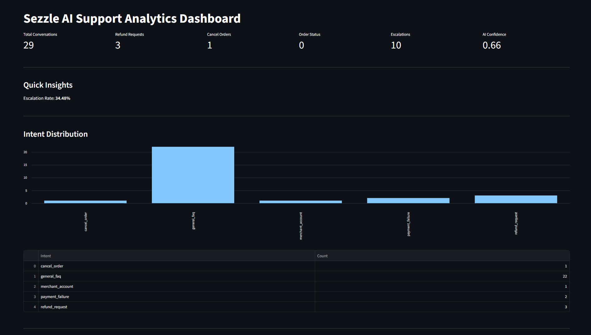
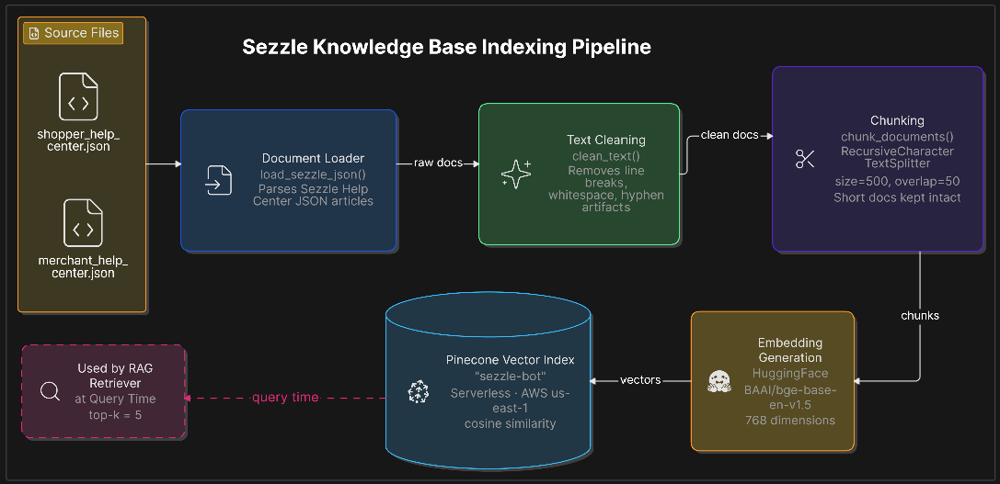
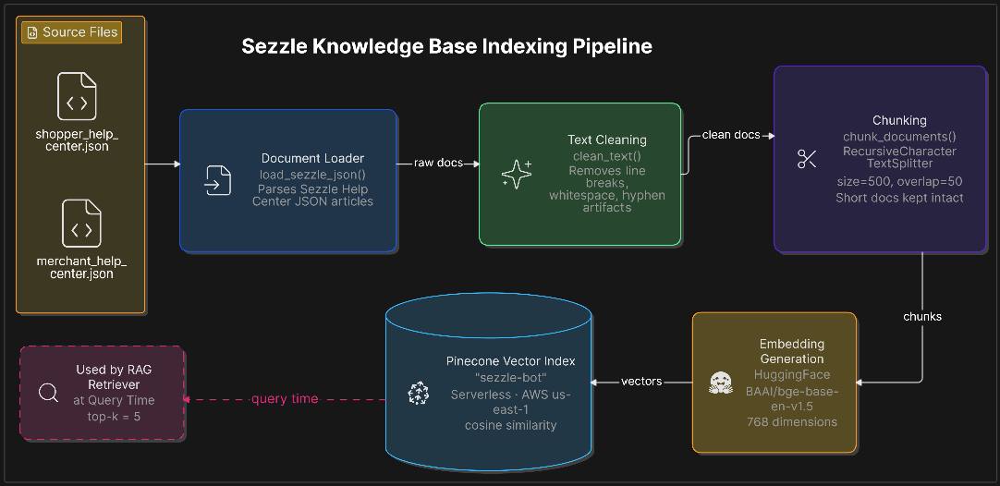

<p align="center">
  
</p>

---

<h2 align="center">Unofficial Sezzle AI Customer Support Chatbot & Agent</h2>

---

<div align="center">

### A Retrieval-Augmented Generation (RAG) powered AI support agent for Sezzle, built with intent classification, agentic order actions, confidence-based escalation, and a real-time analytics dashboard.

[](https://www.python.org/)
[](https://fastapi.tiangolo.com/)
[](https://www.langchain.com/)
[](https://www.pinecone.io/)
[](https://groq.com/)
[](https://react.dev/)
[](https://streamlit.io/)
[](https://www.docker.com/)
[](LICENSE)

[Live Demo](#live-demo) • [Features](#features) • [Architecture](#architecture) • [Tech Stack](#tech-stack) • [Getting Started](#getting-started) • [API Reference](#api-reference) • [Roadmap](#roadmap)

</div>

---

## Overview

**Sezzle AI Customer Support Agent** is an end-to-end, production-style conversational AI system built to handle real-world customer support for **Sezzle**, a Buy Now Pay Later (BNPL) fintech platform.

Unlike a simple FAQ chatbot, this project combines **three layers of intelligence**:

1. **Retrieval-Augmented Generation (RAG)** — answers are grounded strictly in Sezzle's official Shopper & Merchant Help Center content, preventing hallucinated policies, fees, or refund timelines.
2. **Intent Classification + Agentic Actions** — the agent detects user intent (refund, cancel order, order status, etc.) and can *act* on it directly (e.g., cancel an order, initiate a refund) rather than just describing how to do it.
3. **Confidence Scoring & Escalation** — every response is scored for retrieval confidence. Low-confidence queries are automatically escalated to human support instead of risking an incorrect answer.

The system is wrapped in a **FastAPI** backend, a polished **React + Framer Motion** chat widget frontend, and a **Streamlit analytics dashboard** for monitoring conversation trends, intent distribution, and escalation rates in real time.

> **Why this project exists:** Built as a portfolio project to demonstrate production-grade GenAI engineering skills — RAG pipeline design, vector search, agentic tool execution, prompt engineering for grounded responses, and full-stack deployment — directly targeted at AI/ML and Applied AI engineering roles in fintech.

---

## Features

- **RAG-Powered Q&A** — Retrieves relevant context from Pinecone (vector DB) over Sezzle's Shopper & Merchant Help Center articles before generating an answer.
- **Strict Grounded Responses** — Custom system prompt enforces zero hallucination: the LLM only answers from retrieved context and explicitly refuses to invent fees, timelines, or policies.
- **Intent Classification** — Every query is classified into one of: `refund_request`, `chargeback`, `cancel_order`, `order_status`, `payment_failure`, `merchant_account`, `checkout_issue`, `general_faq`.
- **Agentic Order Actions** — Detects order IDs (e.g., `SZ1234`) and directly executes actions:
  - Cancel an order
  - Initiate a refund
  - Check order status
- **Confidence Scoring & Auto-Escalation** — Computes similarity confidence for every retrieval; queries below a threshold are automatically flagged for human escalation instead of guessing.
- **Conversation Logging** — All conversations (query, intent, confidence, escalation flag, timestamp) are persisted to SQLite for analytics.
- **Live Analytics Dashboard** — A Streamlit dashboard visualizes total conversations, intent distribution, escalation rate, average confidence, and daily trends.
- **Modern Chat Widget UI** — A floating, animated chat widget (React + Framer Motion) with quick-action buttons, typing indicators, and a voice-mode UI concept.
- **Containerized Deployment** — Dockerfile included for one-command deployment (currently live on Hugging Face Spaces).

---

## Live Demo

| Component | Link |
|---|---|
| Live Chat Widget (Frontend) | `https://sezzle-ai-customer-support-agent.vercel.app/` |
| Backend API (FastAPI on Hugging Face Spaces) | `https://harerpratham-sezzle-ai-customer-support-agent.hf.space` |
| Analytics Dashboard (Streamlit) | `https://huggingface.co/spaces/HarerPratham/sezzle-ai-dashboard` |

### Video Demo

<div align="center">

[](#)

</div>

---

## Screenshots

### Chatbot 
<p align="center">
  
</p>

### Sqite Database
<p align="center">
  
</p>

### Streamlit dashboard
<p align="center">
  
</p>

---

## Architecture

<p align="center">
  
</p>

### Data Pipeline (Offline / One-Time)

<p align="center">
  
</p>

Run via `store_index.py` — a one-time (or re-runnable) script that builds and populates the Pinecone index.

---

## Tech Stack

### Backend / AI
- **Python 3.11**
- **FastAPI** — REST API server
- **LangChain** (`langchain`, `langchain-core`, `langchain-community`, `langchain-text-splitters`) — orchestration of the RAG pipeline
- **LangChain-Groq** — LLM inference via **Groq** (`llama-3.3-70b-versatile`)
- **LangChain-Pinecone** — vector store integration
- **Pinecone** — serverless vector database (AWS, `us-east-1`)
- **HuggingFace Embeddings** — `BAAI/bge-base-en-v1.5` (768-dim)
- **SQLite** — lightweight persistence for conversation logs & analytics
- **Wasabi** — pretty console logging

### Frontend
- **React 19** + **Vite 8**
- **Framer Motion** — chat widget animations
- **React Icons**
- **Spline** — embedded 3D voice-mode visual

### Analytics
- **Streamlit** + **Pandas** — real-time KPI dashboard

### DevOps
- **Docker** — containerized backend, deployed to **Hugging Face Spaces**
- **Vercel** — frontend hosting (planned/expected)

---

## Project Structure

```
sezzle-ai-customer-support-agent/
├── app.py                      # FastAPI app — RAG chain, intent classifier, agentic actions, routes
├── database.py                 # SQLite connection, schema, and conversation logging
├── store_index.py              # One-time script to build the Pinecone vector index
├── streamlit_app.py            # Streamlit analytics dashboard
├── requirements.txt            # Backend Python dependencies
├── dashboard_requirements.txt  # Streamlit dashboard dependencies
├── runtime.txt                 # Python runtime version (for HF Spaces)
├── Dockerfile                  # Container build for deployment
├── setup.py                    # Package metadata
│
├── data/
│   ├── shopper_help_center.json   # Sezzle Shopper Help Center articles
│   ├── merchant_help_center.json  # Sezzle Merchant Help Center articles
│   └── partner_help_center.json   # Sezzle Partner Help Center articles (not indexed)
│
├── src/
│   ├── helper.py                # JSON loading, text cleaning, chunking, embeddings
│   └── prompt.py                # Grounded system prompt template (PROMPT)
│
├── templates/
│   └── chat.html                # Standalone HTML chat UI served at "/"
│
├── frontend/                    # React + Vite chat widget
│   ├── src/
│   │   ├── App.jsx              # Main chat widget component
│   │   ├── App.css
│   │   └── main.jsx
│   ├── public/                  # Static assets (logos, icons)
│   └── package.json
│
└── research/
    └── trials.ipynb             # Exploratory notebook / experimentation
```

---

## Getting Started

### Prerequisites

- Python **3.11+**
- Node.js **18+** (for the frontend)
- API keys for:
  - [Pinecone](https://www.pinecone.io/)
  - [Groq](https://groq.com/)
  - [HuggingFace](https://huggingface.co/) (for embedding model access)

### 1. Clone the Repository

```bash
git clone https://github.com/Pratham1603/sezzle-ai-customer-support-agent.git
cd sezzle-ai-customer-support-agent
```

### 2. Backend Setup

```bash
# Create and activate a virtual environment
python -m venv venv
source venv/bin/activate   # On Windows: venv\Scripts\activate

# Install dependencies
pip install -r requirements.txt
```

Create a `.env` file in the project root:

```env
PINECONE_API_KEY=your_pinecone_api_key
HUGGINGFACE_API_KEY=your_huggingface_api_key
GROQ_API_KEY=your_groq_api_key
```

### 3. Build the Vector Index (one-time)

This loads, cleans, chunks, and embeds the Sezzle Help Center articles into Pinecone:

```bash
python store_index.py
```

> Set `FORCE_RELOAD = True` inside `store_index.py` if you want to wipe and re-populate the index.

### 4. Run the Backend

```bash
uvicorn app:app --reload --host 0.0.0.0 --port 8000
```

The API will be available at `http://localhost:8000`, and a built-in chat UI is served at `http://localhost:8000/`.

### 5. Run the Analytics Dashboard

```bash
pip install -r dashboard_requirements.txt
streamlit run streamlit_app.py
```

> Update the `API_URL` constant at the top of `streamlit_app.py` if your backend is not running on the default Hugging Face URL.

### 6. Run the React Frontend (optional chat widget)

```bash
cd frontend
npm install
npm run dev
```

> Update the `fetch` URL inside `frontend/src/App.jsx` to point to your local backend (`http://localhost:8000/get`) if testing locally.

---

## Docker

Build and run the backend as a container:

```bash
docker build -t sezzle-ai-agent .
docker run -p 7860:7860 --env-file .env sezzle-ai-agent
```

The app will be available at `http://localhost:7860`.

---

## API Reference

| Method | Endpoint | Description |
|---|---|---|
| `GET` | `/` | Serves the built-in HTML chat interface |
| `GET` | `/health` | Health check |
| `POST` | `/get` | Main chat endpoint — accepts `msg` (form data), returns the agent's response, intent, confidence, and escalation status |
| `GET` | `/analytics` | Aggregated KPIs — total conversations, intent breakdown, escalation count, average confidence |
| `GET` | `/recent-conversations` | Returns the 10 most recent logged conversations |
| `GET` | `/daily-trends` | Returns conversation counts grouped by day |

### Example: `POST /get`

**Request**
```bash
curl -X POST http://localhost:8000/get \
  -d "msg=What is the status of order SZ1234?"
```

**Response**
```json
{
  "agent_action": true,
  "intent": "order_status",
  "answer": "Order SZ1234 is currently Processing."
}
```

**Example — General FAQ (RAG response)**
```json
{
  "answer": "To request a refund, you need to...",
  "intent": "refund_request",
  "confidence": 0.84,
  "confidence_level": "high",
  "escalate": false
}
```

**Example — Low Confidence (Escalation)**
```json
{
  "answer": "I'm not confident enough to answer this question. Please contact Sezzle support.",
  "intent": "general_faq",
  "confidence": 0.41,
  "confidence_level": "low",
  "escalate": true
}
```

---

## How It Works

1. **User sends a message** via the chat widget or `/get` endpoint.
2. **Intent Classification** — A lightweight LLM call (Groq, `llama-3.3-70b-versatile`) classifies the message into a fixed set of support intents.
3. **Agentic Routing** — If the intent maps to an actionable task (`cancel_order`, `refund_request`, `order_status`) and an order ID (e.g., `SZ1234`) is detected in the message, the corresponding action is executed against the mock order database and a direct response is returned — bypassing the RAG pipeline entirely.
4. **RAG Fallback** — For all other queries, the system retrieves the top-5 most relevant chunks from the Pinecone vector index (Shopper + Merchant Help Center content) and passes them, along with the query, into a strict grounded prompt (`src/prompt.py`).
5. **Confidence Scoring** — The maximum similarity score from retrieval determines a confidence level (`high` ≥ 0.80, `medium` ≥ 0.60, `low` < 0.60). Queries scoring below 0.60 are escalated instead of being answered.
6. **Logging** — Every interaction (query, intent, confidence, escalation flag, timestamp) is written to a local SQLite database for analytics.
7. **Analytics Dashboard** — The Streamlit app polls `/analytics`, `/recent-conversations`, and `/daily-trends` to visualize support trends in real time.

---

## Contributing

Contributions, issues, and feature requests are welcome!

1. Fork the repository
2. Create your feature branch (`git checkout -b feature/amazing-feature`)
3. Commit your changes (`git commit -m 'Add amazing feature'`)
4. Push to the branch (`git push origin feature/amazing-feature`)
5. Open a Pull Request

---

## License

This project is licensed under the **MIT License** — see the [LICENSE](LICENSE) file for details.

---

## Author

**Pratham Harer**

<div align="center">

If you found this project useful, consider giving it a star.

</div>
